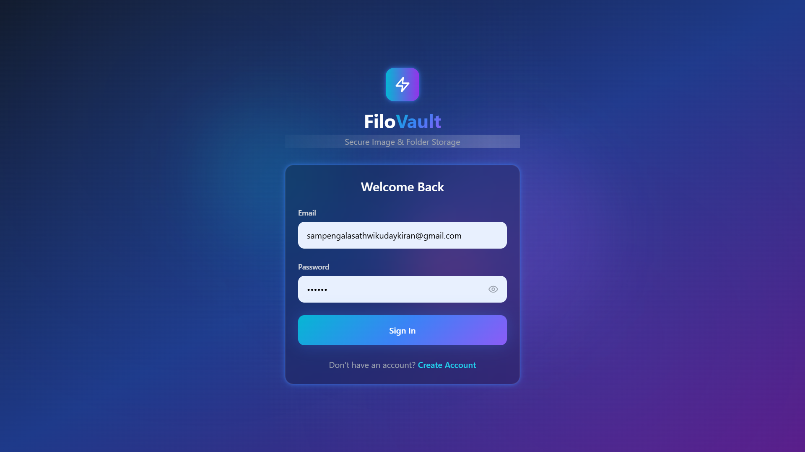
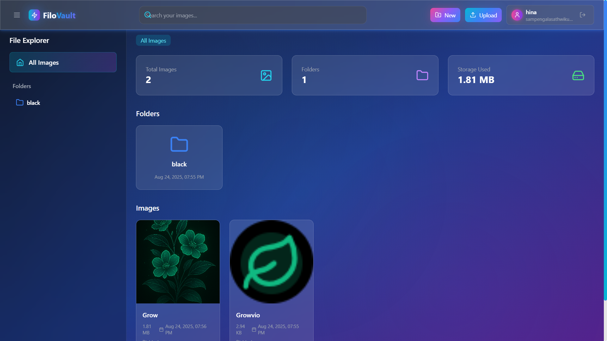
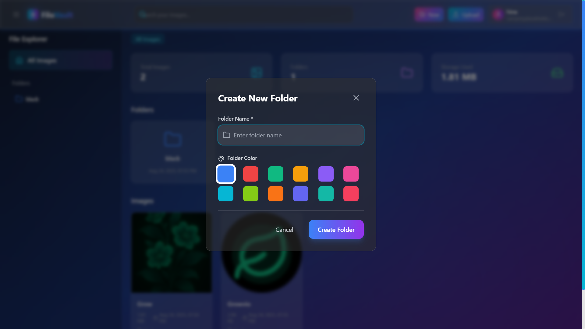
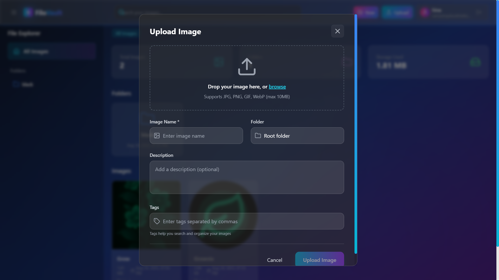
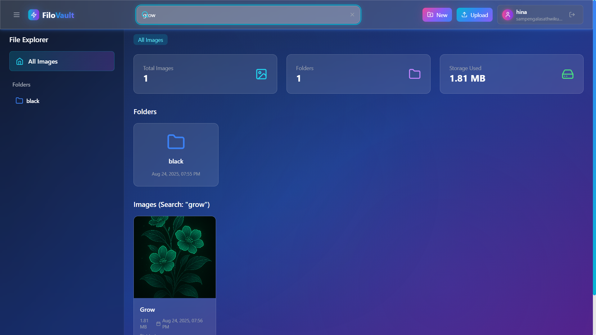

# 🚀 FiloVault — Futuristic Image & Folder Manager

[](https://reactjs.org/)
[](https://vitejs.dev/)
[](https://tailwindcss.com/)
[](https://expressjs.com/)
[](https://mongodb.com/)

FiloVault is a modern, full-stack web application for organizing images and folders with a beautiful, animated UI. Built with React, Vite, TailwindCSS, and a Node.js/Express/MongoDB backend, it delivers a seamless experience for secure image storage, advanced search, and intelligent folder management.

## ✨ Features

- **🔐 Authentication:** Secure JWT-based login/register flow with encrypted password storage
- **📊 Dashboard:** Animated, glassmorphic UI with sidebar navigation and real-time stats
- **📁 Smart Folders:** Create, color-code, and nest folders with safety checks and bulk operations
- **🖼️ Image Management:** Upload, preview, search, tag, and organize images with metadata support
- **🔍 Advanced Search:** Real-time suggestions, fuzzy search, and contextual dropdown with instant results
- **📱 Responsive Design:** Mobile-first, adaptive layouts that work seamlessly across all devices
- **🎨 Stunning Animations:** Neon glows, gradients, ripple effects, and floating geometric elements
- **♿ Accessibility:** Focus rings, reduced motion support, and complete keyboard navigation
- **🌙 Dark Theme:** Beautiful dark mode with glassmorphic elements and neon accents

---

## 📸 Screenshots

### Authentication Flow

*Secure authentication with animated background and glassmorphic design*


### Main Dashboard

*Modern dashboard with animated statistics, folder overview, and recent images*

### Folder Management

*Interactive folder creation modal with color picker and parent selection*

### Image Operations

*Drag & drop image upload with preview and metadata entry*


### Search & Discovery

*Real-time search with live suggestions and contextual results*

---

## 🧩 Key Components

### 🎯 [`Header`](src/components/Header.jsx)
- **Sidebar Toggle:** Smooth open/close animation for the file explorer
- **Animated Logo:** Gradient text with pulsing glow effects
- **Smart Search Bar:** 
  - Debounced input with 300ms delay for optimal performance
  - Live dropdown with top 5 suggestions by name, tags, and folder
  - Full keyboard navigation and mouse accessibility
  - Clear button with smooth transitions
- **Action Buttons:** 
  - Create Folder (opens modal with form validation)
  - Upload Images (drag & drop support)
- **User Profile:** 
  - Gradient avatar with user initials
  - Username and email display
  - One-click logout with confirmation

### 🗂️ [`Sidebar`](src/components/Sidebar.jsx)
- **Folder Tree:** Expandable/collapsible hierarchy with smooth animations
- **Quick Stats:** Real-time folder and image counts
- **Navigation:** Click to filter images by folder
- **Responsive:** Auto-collapse on mobile devices

### 📋 [`FileExplorer`](src/components/FileExplorer.jsx)
- **Grid Layout:** Responsive masonry-style image grid
- **Quick Actions:** Preview, download, delete, and move operations
- **Breadcrumbs:** Clear navigation path with click-to-navigate
- **Loading States:** Skeleton loaders and smooth transitions

### 📤 [`UploadModal`](src/components/UploadModal.jsx)
- **Drag & Drop:** Intuitive file dropping with visual feedback
- **Multi-upload:** Batch processing with progress indicators
- **Preview:** Thumbnail generation before upload
- **Metadata:** Add tags, descriptions, and folder assignments

### 🎨 [`CreateFolderModal`](src/components/CreateFolderModal.jsx)
- **Color Picker:** 12 beautiful gradient options
- **Parent Selection:** Dropdown with folder hierarchy
- **Form Validation:** Real-time error checking and feedback
- **Preview:** Live folder appearance preview

---

## 🛠️ Tech Stack

### Frontend
- **React 18** - Latest features with concurrent rendering
- **Vite** - Lightning-fast development and build tool
- **TailwindCSS** - Utility-first styling with custom animations
- **Lucide Icons** - Beautiful, consistent iconography
- **Context API** - State management for auth and global data

### Backend
- **Express.js** - Fast, minimalist web framework
- **MongoDB** - Document-based database with GridFS for files
- **Mongoose** - Elegant MongoDB object modeling
- **Multer** - Middleware for handling multipart/form-data
- **JWT** - Secure token-based authentication
- **bcryptjs** - Password hashing and verification

### Styling & Animation
- **Glassmorphism** - Frosted glass effects with backdrop blur
- **Custom Gradients** - Dynamic color schemes with CSS variables
- **CSS Animations** - Smooth transitions and micro-interactions
- **Responsive Design** - Mobile-first approach with breakpoint optimization

---

## 🚦 Getting Started

### Prerequisites
- **Node.js** 18.x or higher
- **MongoDB** 5.x or higher (local or Atlas)
- **npm** or **yarn** package manager

### Installation

1. **Clone the repository**
```bash
git clone https://github.com/yourusername/filovault.git
cd filovault
```

2. **Install frontend dependencies**
```bash
cd client
npm install
```

3. **Install backend dependencies**
```bash
cd ../server
npm install
```

4. **Environment Setup**

Create `.env` file in the server directory:
```env
PORT=5000
MONGODB_URI=mongodb://localhost:27017/filovault
JWT_SECRET=your-super-secret-jwt-key-here

```

Create `.env` file in the client directory:
```env
VITE_API_URL=http://localhost:5000/api
VITE_APP_NAME=FiloVault
```

5. **Start the development servers**

Backend server:
```bash
cd server
npm run dev  # Uses nodemon for auto-restart
```

Frontend development server:
```bash
cd client
npm run dev  # Starts Vite dev server
```

6. **Access the application**
- Frontend: `http://localhost:5173`
- Backend API: `http://localhost:4000`

---

## 📁 Project Structure

```
filovault/
├── client/                    # React frontend
│   ├── src/
│   │   ├── components/        # Reusable UI components
│   │   │   ├── Header.jsx
│   │   │   ├── Sidebar.jsx
│   │   │   ├── FileExplorer.jsx
│   │   │   ├── UploadModal.jsx
│   │   │   └── CreateFolderModal.jsx
│   │   ├── contexts/          # React context providers
│   │   │   └── AuthContext.jsx
│   │   ├── pages/             # Route components
│   │   │   ├── Login.jsx
│   │   │   ├── Register.jsx
│   │   │   └── Dashboard.jsx
│   │   ├── utils/             # Helper functions
│   │   ├── assets/            # Static assets
│   │   └── styles/            # CSS and animations
│   ├── public/
│   └── screenshots/           # App screenshots for README
├── server/                    # Express backend
│   ├── controllers/           # Route handlers
│   ├── middleware/            # Custom middleware
│   ├── models/                # Mongoose schemas
│   ├── routes/                # API routes
│   ├── uploads/               # File storage directory
│   └── utils/                 # Server utilities
├── docs/                      # Documentation
└── README.md
```

---

## 🔌 API Endpoints

### Authentication
- `POST /api/auth/register` - User registration
- `POST /api/auth/login` - User login
- `GET /api/auth/me` - Get current user

### Folders
- `GET /api/folders` - List all folders
- `POST /api/folders` - Create new folder
- `PUT /api/folders/:id` - Update folder
- `DELETE /api/folders/:id` - Delete folder

### Images
- `GET /api/images` - List images (with search & folder filter)
- `GET /api/images/suggestions` - Search suggestions
- `POST /api/images/upload` - Upload images
- `DELETE /api/images/:id` - Delete image
- `GET /api/images/:id/download` - Download image

---

## 🎨 Design System

### Colors
- **Primary:** Cyan (`#06b6d4`) to Purple (`#8b5cf6`) gradients
- **Secondary:** Pink (`#ec4899`) to Violet (`#7c3aed`) gradients
- **Accent:** Neon Cyan (`#00ffff`) for highlights
- **Background:** Dark gradients from Gray-900 to Blue-900 to Purple-900
- **Glass:** Semi-transparent overlays with backdrop blur

### Typography
- **Headings:** Inter font family with gradient text effects
- **Body:** Clean, readable text with proper contrast ratios
- **Code:** Monospace fonts for technical elements

### Animations
- **Hover Effects:** Scale transforms and glow intensification
- **Loading States:** Spinning rings and pulse animations
- **Transitions:** Smooth 300ms ease-in-out for all interactions
- **Micro-interactions:** Button ripples and focus indicators

---

## 🚀 Deployment

### Frontend (Vercel)
```bash
cd client
npm run build
npx vercel --prod
```

### Backend (Railway/Render)
```bash
cd server
# Set environment variables in platform dashboard
# Deploy directly from GitHub repository
```

### Database (MongoDB Atlas)
- Create cluster and get connection string
- Update `MONGODB_URI` in production environment

---

## 🤝 Contributing

1. **Fork the repository**
2. **Create feature branch:** `git checkout -b feature/amazing-feature`
3. **Commit changes:** `git commit -m 'Add amazing feature'`
4. **Push to branch:** `git push origin feature/amazing-feature`
5. **Open Pull Request**

### Development Guidelines
- Follow React best practices and hooks patterns
- Use TypeScript-style JSDoc comments for better IDE support
- Maintain consistent code formatting with Prettier
- Write meaningful commit messages following conventional commits
- Test components thoroughly across different screen sizes

---


## 🙏 Acknowledgments

- **React Team** - For the amazing framework and developer experience
- **Tailwind Labs** - For the beautiful utility-first CSS framework
- **Lucide** - For the gorgeous icon library
- **MongoDB** - For the flexible document database
- **Vercel** - For seamless deployment and hosting

---


<div align="center">

**⭐ Star this repository if you find it helpful!**

Made with ❤️ by SathwikUK


</div>
